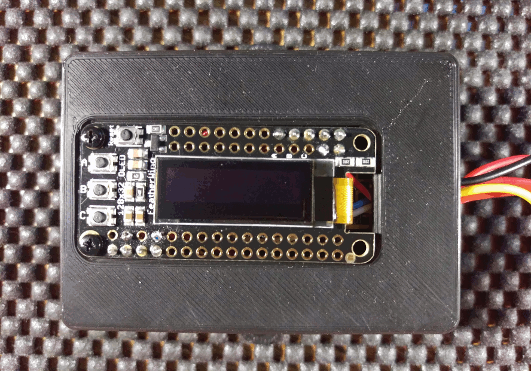

Atmel SAMD21 Adafruit Feather M0 Monitor
-------------------------------
This is a firmware application written in C++ using
<a href="https://github.com/platformio/platformio-pkg-framework-arduinosam">
Arduino</a> and<a href="https://github.com/adafruit/"> Adafruit</a> libraries.
It monitors time, temperature, humidity, battery voltage, and current. Sensor
readings are posted to
<a href="https://learn.adafruit.com/adafruit-io/overview#"> io.adafruit.com</a>
using <a href="https://learn.adafruit.com/adafruit-io/mqtt-api">MQTT</a>.
Readings can also be obtained on the Feather OLED (SSD1306) using the contact
switches. This project is a near-clone of
<a href="https://github.com/patrickmoffitt/ESP8266-Monitor"> ESP8266 Adafruit
Huzzah Monitor</a>. I built it because the Feather M0 offers
<a href="https://learn.adafruit.com/adafruit-feather-m0-wifi-atwinc1500?view=all#overview">
dramatically lower (~2mA) sleep-time power consumption</a> compared to the
ESP8266 Huzzah.




### Motivation

I own two <a href="http://a.co/4hNYmYY ">Everspring Z-Wave Wireless Temperature
and Humidity sensors</a>. Apparently they are no longer being made. At least I
couldn't find any for sale, so I decided to build something similar myself. The
Everspring provides temperature and humidity readings. It can post this data via
Z-Wave to a hub. Mine run for about a year on three lithium AAA batteries.

My replacement uses off-the-shelf bits I bought from the good folks at Adafruit
Industries. Like the Everspring my device has a
<a href="https://learn.adafruit.com/3d-printed-case-for-adafruit-feather">nice
plastic case</a>. The bottom compartment of that case holds a
<a href="https://www.adafruit.com/product/328">2500mAh Lithium Ion Polymer
Battery</a>. The battery is connected to an
<a href="https://www.adafruit.com/product/805">on/off switch</a> using a
<a href="https://www.adafruit.com/product/1131">cable</a> and a
<a href="https://www.adafruit.com/product/1769">connector</a>. That plugs into
the <a href="https://www.adafruit.com/product/2821">ESP8266 Huzzah</a> module
sitting in the middle part of the case. The temperature and humidity readings
are given by a <a href="https://www.adafruit.com/product/393">DHT22
(AM3202)</a> sensor. The current readings come from an
<a href="https://www.adafruit.com/product/904">INA219</a>. The display and push
buttons are the <a href="https://www.adafruit.com/product/2900">Feather
OLED</a>. I built my own voltage divider to provide the battery voltage. The
details of that are on the schematic:


All put together it looks like this:


The size of the DHT22 is a bit large but quite acceptable given its more
accurate than the smaller siblings in the same sensor family. The red and black
extension cord has the JST-HXP connectors used by my experiments. Its connected
to the inputs of the current sensor. The lid of the box is the top part of the
case. The blue cable on the left connects to a USB charger to top-up the
battery.

Building the Code
-----------------
I used the <a href="https://platformio.org">platformio</a> build system with
<a href="https://www.jetbrains.com/clion/">JetBrains CLion</a> to build this
project. If you plan to do so you'll need a platformio.ini file of your own. I
excluded mine from this repo because it contains all my secrets. I define
build_flags for secrets like my WiFi password and io.adafruit.com key. This
keeps them together and out of the source code for improved security and ease of
management. You can build you own using this template:

```
; PlatformIO Project Configuration File
;
;   Build options: build flags, source filter
;   Upload options: custom upload port, speed and extra flags
;   Library options: dependencies, extra library storages
;   Advanced options: extra scripting
;
; Please visit documentation for the other options and examples
; http://docs.platformio.org/page/projectconf.html
[platformio]
; MacOS X / Linux
lib_extra_dirs = ${env.HOME}/Documents/Arduino/libraries

[common]
lib_deps_external =
    https://github.com/adafruit/Adafruit-GFX-Library/archive/master.zip
    https://github.com/adafruit/Adafruit_FeatherOLED/archive/master.zip
    https://github.com/adafruit/Adafruit_SSD1306/archive/master.zip
    https://github.com/adafruit/Adafruit_Sensor/archive/master.zip
    https://github.com/adafruit/DHT-sensor-library/archive/master.zip
    https://github.com/adafruit/Adafruit_INA219/archive/master.zip

[env:huzzah]
platform = atmelsam
framework = arduino
board = adafruit_feather_m0
upload_port = /full/path/to/your/USB-TTL-DEVICE
upload_speed = 115200
lib_deps =
    ${common.lib_deps_external}
build_flags =
    '-DGMT_OFFSET=-5'
    '-DWIFI_SSID="WiFi_AP_SSID"'
    '-DWIFI_PASS="WiFi Password"'
    '-DWIFI_MAC_ADDR={0xE0, 0x9A, 0x4C, 0xB5, 0x5F, 0xC7}'
    '-DAIO_USERNAME="adafruit_user_name"'
    '-DAIO_KEY="dafruit_user_key"'
    '-DAIO_SERVER="io.adafruit.com"'
    '-DAIO_SERVERPORT=8883'
    '-DAIO_FLOAT_PRECISION=2'
    '-DAIO_GROUP_KEY="monitor-two"'
    '-DAIO_MQTT_PAYLOAD_FLOAT_MAX_SIZE=6'
```
You may want to redefine the following:
* GMT_OFFSET — The number of hours (or fraction thereof) your timezone is offset
from UTC/GMT.
* WIFI_SSID — Your WiFi access point's Service Set Identifier (SSID) or name.
* WIFI_PASS — Your WiFi access point's password.
* WIFI_MAC_ADDR — The six digit ethernet address of your ESP8266. I assign it so
that it will matchup with my DHCP server's configuration. I assign it a fixed IP
based upon it's Medium Access Controller (MAC) address.
* AIO_USERNAME — Your Adafruit IO username.
* AIO_KEY — Your Adafruit IO key (click the AIO Key button on a dashboard to
  find the key).
* AIO_SERVERPORT — The AIO server port. 8883 is correct for SSL clients.
* AIO_FLOAT_PRECISION — The number of decimal places to send to your feeds. The
API only sends strings. This number determines how many decimal places are kept
when floats are converted to strings for sending.
* AIO_GROUP_KEY — If your feeds are grouped, put the group name here.
* AIO_MQTT_PAYLOAD_FLOAT_MAX_SIZE — The API supports up to 29. Save memory by
defining a lower value if you can.

Application Notes
-----------------
I hope these notes will help to explain some software design and implementation
details which might not otherwise be immediately apparent.

### Time of Day
This application uses the ATWINC1500 to set the clock. Since the
Atmel SAMD21 has no persistent clock, the time must be set upon booting or waking the
system. I couldn't find a
<a href="https://en.wikipedia.org/wiki/Locale_(computer_software)">locale</a>
library to handle timezones and
<a href="https://en.wikipedia.org/wiki/Daylight_saving_time">Daylight Saving
Time</a> (DST) for this project so I wrote my own. It only works for the Eastern
timezone. You can modify it for your own locale by updating the DST start and
end dates in the `ntp_time_utils::dst_dates` map. Also change the timezone
abbreviation in `ntp_time_utils::set_dst_usa`.

### Battery voltage
The voltage is read by `get_battery_vdc()` in `monitor_read_battery.cpp`. This
function reads the ADC pin 30 times in one second and averages the results
together. The readings fluctuate based upon WiFi activity. Polling averages away
those fluctuations.

### SSL Certificate Validation
The ATWINC1500 does this auto-magically. All you have to do is
<a  href="https://learn.adafruit.com/adafruit-feather-m0-wifi-atwinc1500?view=all#updating-ssl-certificates">load up the SSL certificates</a>.

Bugs, Issues and Pull Requests
------------------------------
If you find a bug please create an issue. If you'd like to contribute please
send a pull request.
